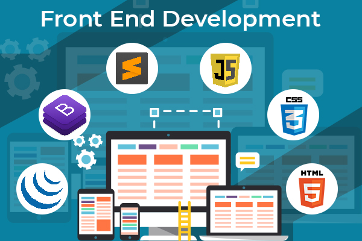

<!-- Header Section -->

# Welcome to my profile!

## Front-End Developer

## My Interests

**Currently learning**:  
- Advanced **JavaScript frameworks** like **React.js** and **Vue.js**
- **UI/UX design** principles to create intuitive and engaging user experiences
- **CSS frameworks** such as **Tailwind CSS** and **Bootstrap**

**Currently working on**:  
- Building responsive and dynamic web interfaces using **HTML5**, **CSS3**, **JavaScript** (ES6+)
- Optimizing performance and accessibility of front-end applications

## Most Wanted Languages & Technologies

  
  

---

### Projects

Here are a few of my front-end development projects:

1)**[ Form with backend]
https://github.com/1234monika/project

2)**[ clock]
https://github.com/1234monika/clock

### Contact Me

- Email: monikarane60@gmail.com  
- LinkedIn: www.linkedin.com/in/monika-rane-91a01b2b5 

---

Thanks for visiting my profile! I’m passionate about creating sleek and fast front-end experiences. Let’s connect!## Hi there 👋

<!--
**1234monika/1234monika** is a ✨ _special_ ✨ repository because its `README.md` (this file) appears on your GitHub profile.

Here are some ideas to get you started:

- 🔭 I’m currently working on ...
- 🌱 I’m currently learning ...
- 👯 I’m looking to collaborate on ...
- 🤔 I’m looking for help with ...
- 💬 Ask me about ...
- 📫 How to reach me: ...
- 😄 Pronouns: ...
- ⚡ Fun fact: ...
-->
